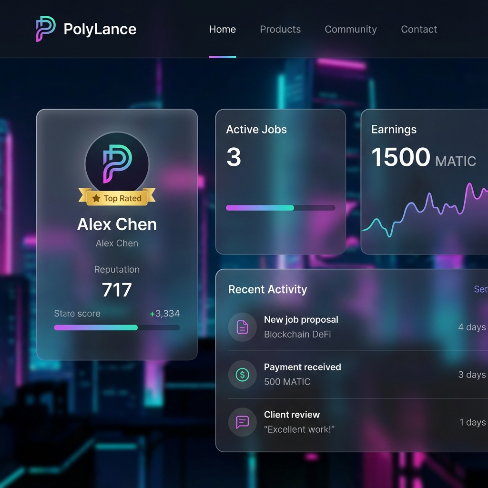
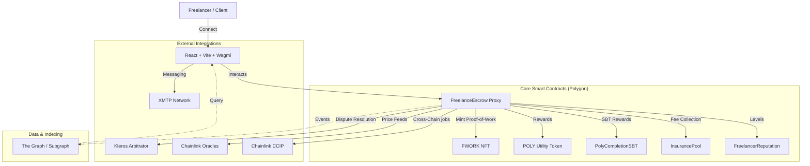

# PolyLance: Enterprise Decentralized Freelance Marketplace
**Developed by:** Akhil Muvva

PolyLance is a high-performance, professional freelance ecosystem built on the Polygon network. It enables secured escrow payments, milestone-based job tracking, on-chain reputation systems, and NFT-based proof-of-work, ensuring a trustless and efficient marketplace for freelancers and clients alike.

## Features
- **Secure escrow payments with milestones**: Funds are locked in smart contracts and released only when work is approved.
- **On-chain reputation system**: Verified reviews and ratings stored directly on the blockchain.
- **NFT-based proof-of-work**: A unique NFT is minted for every completed job, serving as a permanent record of achievement.
- **Real-time messaging via XMTP**: Secure wallet-to-wallet chat powered by XMTP.
- **Multi-token support (MATIC, USDC, DAI)**: Pay in MATIC, USDC, or DAI.
- **Dispute resolution**: Integrated arbitration system for fair conflict resolution.
- **Advanced job filtering**: Filter jobs by category, budget, and search queries.

## Tech Stack
- **Frontend**: React + Vite + Tailwind CSS + Wagmi + RainbowKit
- **Backend**: Node.js + Express + MongoDB
- **Smart Contracts**: Solidity + Hardhat + OpenZeppelin
- **Messaging**: XMTP
- **Indexing**: Custom event syncer

## Screenshots / Demo
| Dashboard | Job Market |
|-----------|------------|
|  |  |

[Add live demo link if deployed]

## Quick Start

### Prerequisites
- Node.js v18+
- MongoDB
- Polygon Amoy testnet RPC
- WalletConnect Project ID

### Setup
1. **Clone and install**
```bash
git clone https://github.com/akhilmuvva/polygon-freelance-marketplace.git
cd polygon-freelance-marketplace
# Install dependencies
cd frontend && npm install && cd ..
cd backend && npm install && cd ..
cd contracts_new && npm install && cd ..

### 3. Environment Variables
Create a `.env` file in the `contracts_new` directory:
```env
PRIVATE_KEY=your_private_key
POLYGON_AMOY_RPC_URL=https://rpc-amoy.polygon.technology/
POLYGONSCAN_API_KEY=your_polygonscan_api_key
```
And in the `frontend` directory:
```env
VITE_WALLET_CONNECT_PROJECT_ID=your_id
VITE_CONTRACT_ADDRESS=your_deployed_address
```
```

2. **Run Development Servers**
- Backend: `cd backend && npm run dev`
- Frontend: `cd frontend && npm run dev`

## 🛡️ Security
PolyLance has undergone initial security auditing. See [AUDIT.md](contracts/AUDIT.md) for detailed findings and remediation steps.

## 🏗️ Technical Architecture

PolyLance is designed with a modular, upgradeable architecture to ensure long-term sustainability and security.

### System Overview (Mermaid)



### Job Lifecycle

1.  **Creation**: Client creates a job, locking funds (MATIC/USDC/DAI) in the `FreelanceEscrow` contract.
2.  **Application**: Freelancers apply by providing a 5% commitment stake.
3.  **Selection**: Client picks a freelancer. Selected freelancer's stake remains locked (upped to 10%), while others are refunded.
4.  **Submission**: Freelancer submits work via IPFS hash.
5.  **Completion**: Client approves work. Funds are released, any remaining stake is returned, and a **Proof-of-Work NFT** + **Completion SBT** are minted.
6.  **Dispute**: If conflict arises, either party can trigger arbitration.

## 🛡️ Security Features

-   **Proxy Pattern**: UUPS (Universal Upgradeable Proxy Standard) for contract maintainability.
-   **Role-Based Access Control**: Granular roles for `ARBITRATOR`, `MANAGER`, and `ADMIN`.
-   **Emergency Stop**: Pausalbe mechanism for critical functions.
-   **Reentrancy Protection**: Industry-standard guards on all state-changing functions.
-   **Meta-Transactions**: Support for gasless interactions via ERC-2771.

## 🚀 Deployment & Development

### Local Setup

1. **Install Dependencies**
   ```bash
   npm install
   cd contracts && npm install
   cd ../frontend && npm install
   ```

2. **Environment Variables**
   Copy `.env.example` to `.env` in the `contracts` and `frontend` directories.

3. **Run Tests**
   ```bash
   cd contracts
   npx hardhat test
   ```

4. **Start Development Frontend**
   ```bash
   cd frontend
   npm run dev
   ```

## 📄 License

Distributed under the MIT License. See `LICENSE` for more information.
